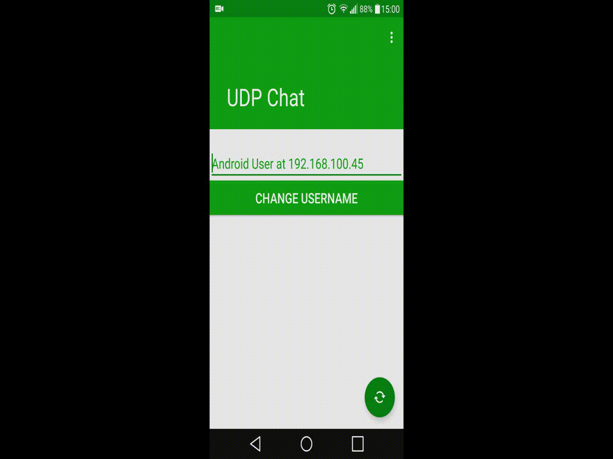
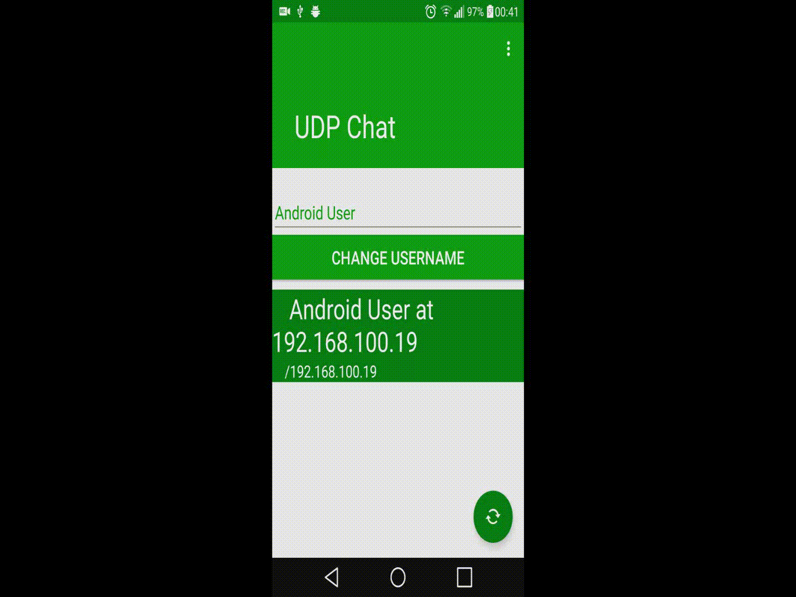
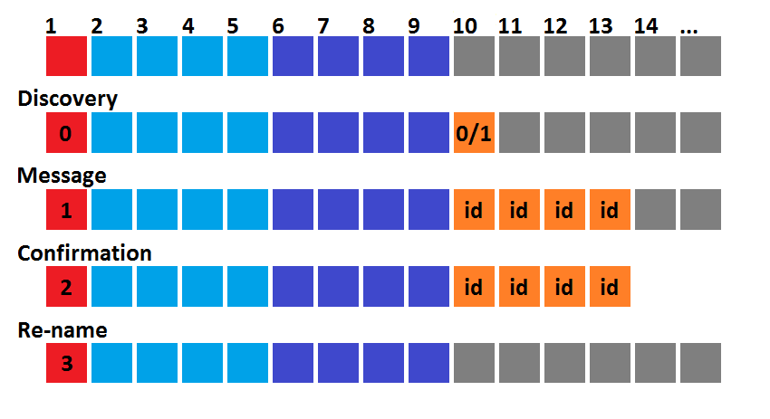
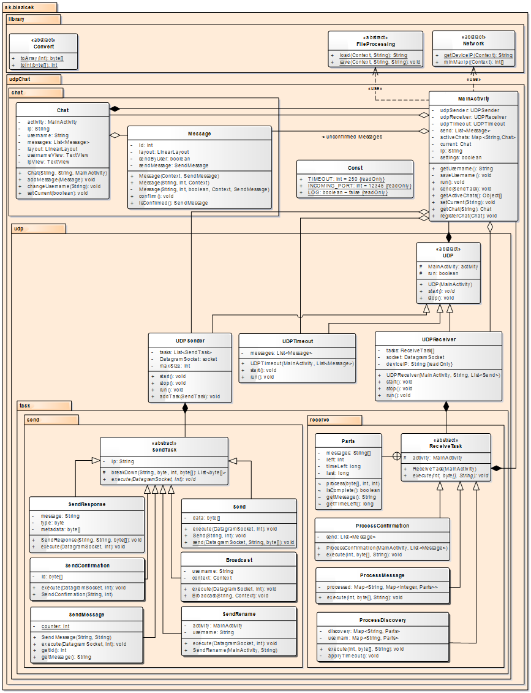

*[SK](README.sk.md)*

[View source code](https://github.com/jozef17/UDP-Chat/app/src/main/java/sk/blazicek)

#  UDP Chat - Android App

P2P Chat app:
- Discovering other users on local network
- Username
- Sending datagrams of chosen size
- Setting sending port
- Timeout

  

## Multithreading
Application uses 4 threads:
- Main thread
- For Sending UDP Datagram
- For Receiving UDP Datagram
- For handling Timeout

### UDPSender

Contains list of sending tasks

Waits (sleeps) if list is empty

Other threads put tasks into list via MainActivity. Thread if notified (waked up) if new task is added.

### UDPReceiver

Waits for incoming Datagram and process it

### UDPTimeout

Sleeps given time, than checks if confirmation message has been received for all Messages, if not re-sends message otherwise removes the message from list.

## Protocol

- 1st byte represents type of message
-- 0 Discovery
-- 1 Message
-- 2 Confirmation
-- 3 Re-name
- 2nd to 5th bytes represents serial number of dataram
- 6th to 9th bytes represents total count of datagrams in series
- other bytes represents metadata or content (depending on type of message)

### Metadata
- Discovery
-- 10th byte 0 for request, 1 for response
- Message
-- 10th to 13th bytes - id of message
- Confirmation
-- 10th to 13th bytes - id of message

## Class Structure

