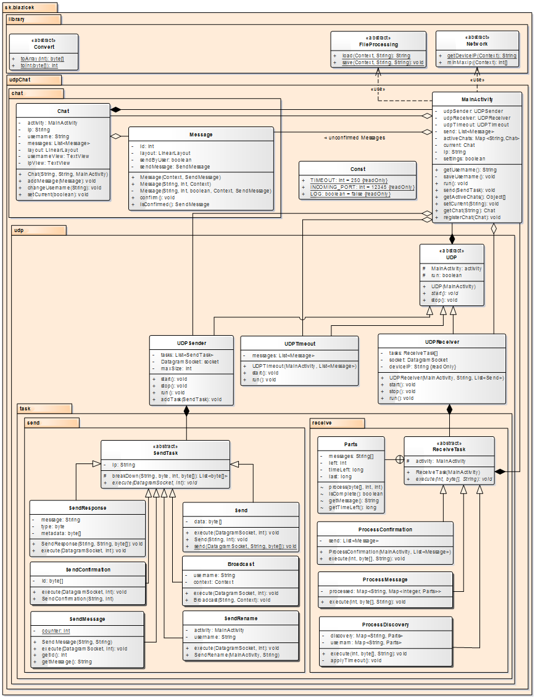

*[EN](README.md)*

[Pozriet zdrojový kód](https://github.com/jozef17/UDP-Chat/tree/master/app/src/main)

#  UDP Chat - Android Aplikácia

P2P Chat Aplikácia:
- Vyhľadanie ostatných používateľov na sieti
- Voľba používateľského mena
- Nastavenie veľkosti datagramov
- Nastavenie odosielajúceho portu
- Timeout

  

## Multithreading
Aplikácia používa 4 vlákna:
- Main thread
- Na posielanie UDP Datagramov
- Na prijímanie UDP Datagramov
- Na správu timeout-u

### UDPSender

Obsahuje Zoznam úloh na odoslanie. Ak je zoznam prázdny, čaká. Ostatné vlákna pridávajú úlohy do zoznamu cez funkciu v triede MainActivity. Vlákno je notifikované v prípade pridania úlohy do listu

### UDPReceiver

Čaká na prichádzajúce správy a spracováva ich. Po prijatí a spracovaní správy pridá potvrdenie do zoznamu úloh pre UDPSender.

### UDPTimeout

Čaká určený čas. Následne skontroluje či pre správy bol obdržaný potvrdzujúci datagram. Ak nebol odošle správu nanovo.

## Protocol

- Prvý bajt reprezentuje typ správy
-- 0 Hľadanie používateľov na sieti
-- 1 Správa
-- 2 Potvrdenie prijatia správy
-- 3 Premenovanie používateľa
- Druhý až piaty bajt reprezentuje poradové číslo datagramu
- Šiesty až deviaty bajt obsahuje celkový počet datagramov správy
- Nasledujúce bajty obsahujú dáta alebo metadáta

### Metadáta
- Hľadanie
-- Desiaty bajt: 0 - požiadavka, 1 - odpoveď
- Správa
-- Desiaty až trinásty bajt - id správy
- Potvrdenie
-- Desiaty až trinásty bajt - id správy

## Štruktúra tried

